<div align="center">

# MetraVision AI

### AI-Assisted Legal Metrology Compliance Intelligence System


</div>

---

An enforcement officer photographs a packaged commodity's label. MetraVision AI
reads the mandatory declarations off it, checks them against the **Legal
Metrology (Packaged Commodities) Rules, 2011** that apply to that product
category, and files the result as an evidence-backed enforcement record that a
senior officer can review, endorse and report on.

| | |
| --- | --- |
| 📱 **Field app** | Guided capture of every face of the package, on-device image-quality checks, instant verdict and a printable report. |
| 🔍 **OCR + extraction** | Self-hosted PaddleOCR reads the label; declarations (MRP, net quantity, manufacturer, dates, consumer care, origin…) are extracted and tied back to the exact line they came from. |
| ⚖️ **Rule engine** | A pure, versioned rule corpus decides compliance. Every finding quotes the rule, clause and Gazette notification verbatim. |
| 🖥️ **Web console** | Inspections, violations, review centre, rule repository, inspector roster and analytics for supervisors. |

---

## Screenshots

### Mobile app — field officer

<p align="center">
  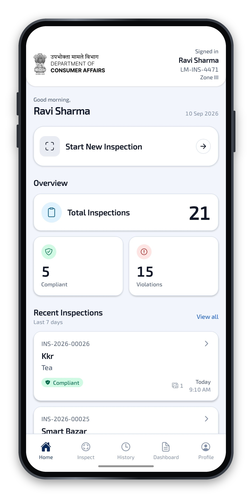
  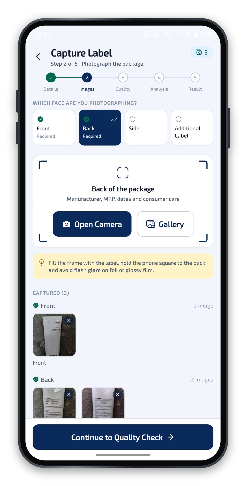
  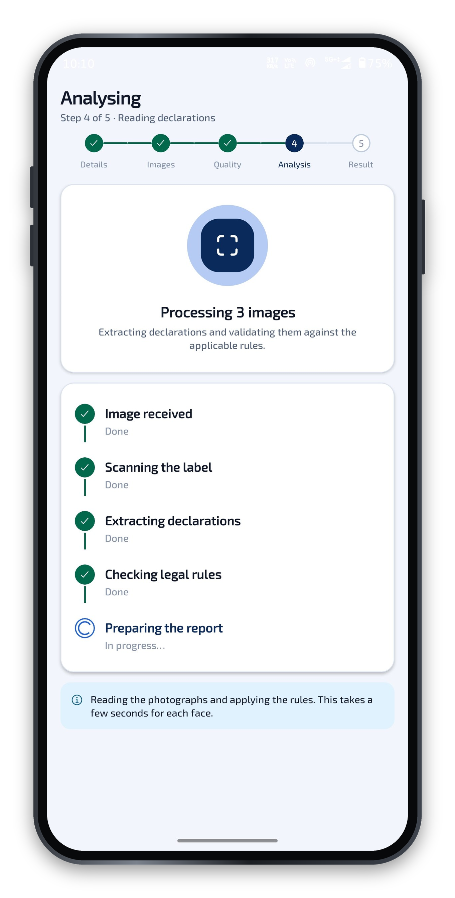
  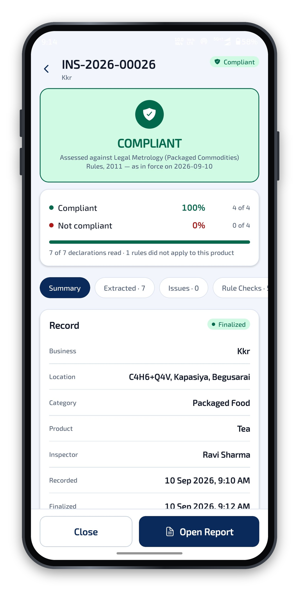
</p>
<p align="center"><sub>Home · Capture every face of the pack · Reading declarations · Verdict with rule-by-rule result</sub></p>

<details>
<summary><b>All mobile screens</b></summary>
<br />
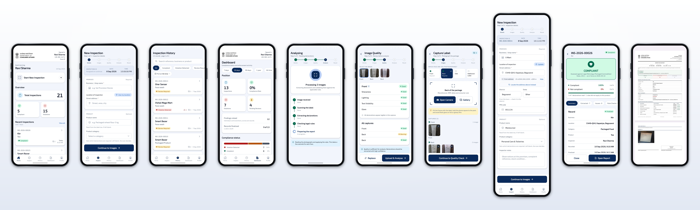
</details>

### Web console — supervisor

| Sign in | Inspections |
| --- | --- |
| 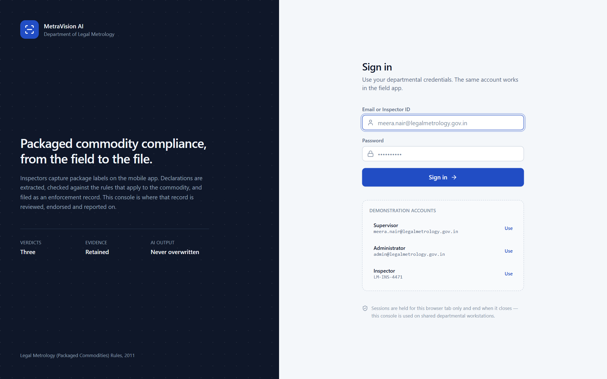 | 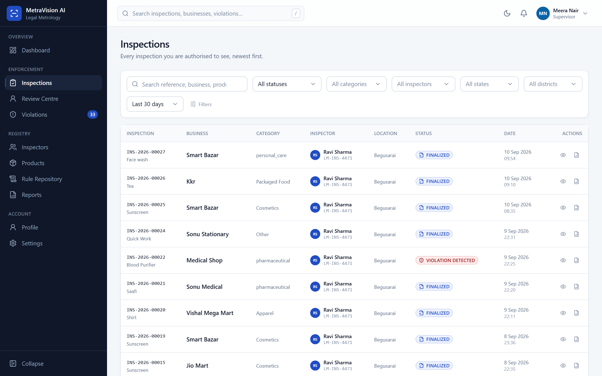 |
| **Inspection record** | **Violations** |
| 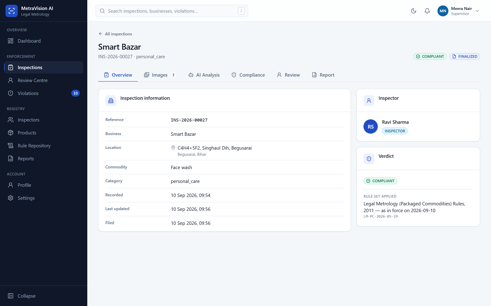 | 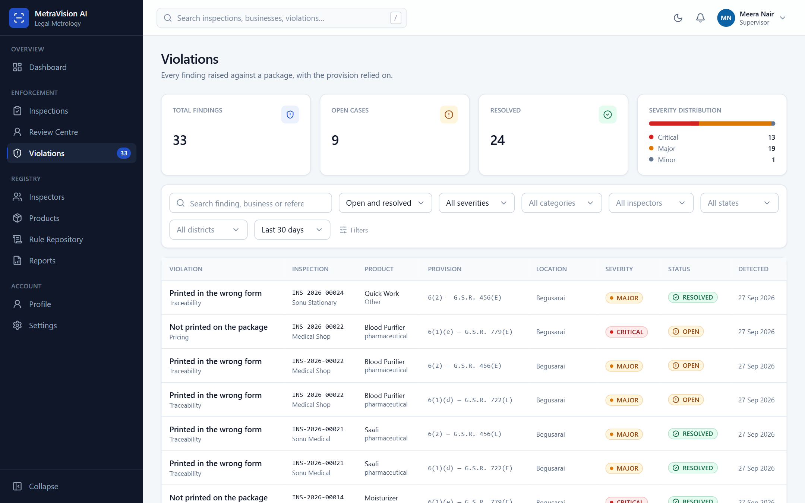 |
| **Rule repository** | |
| 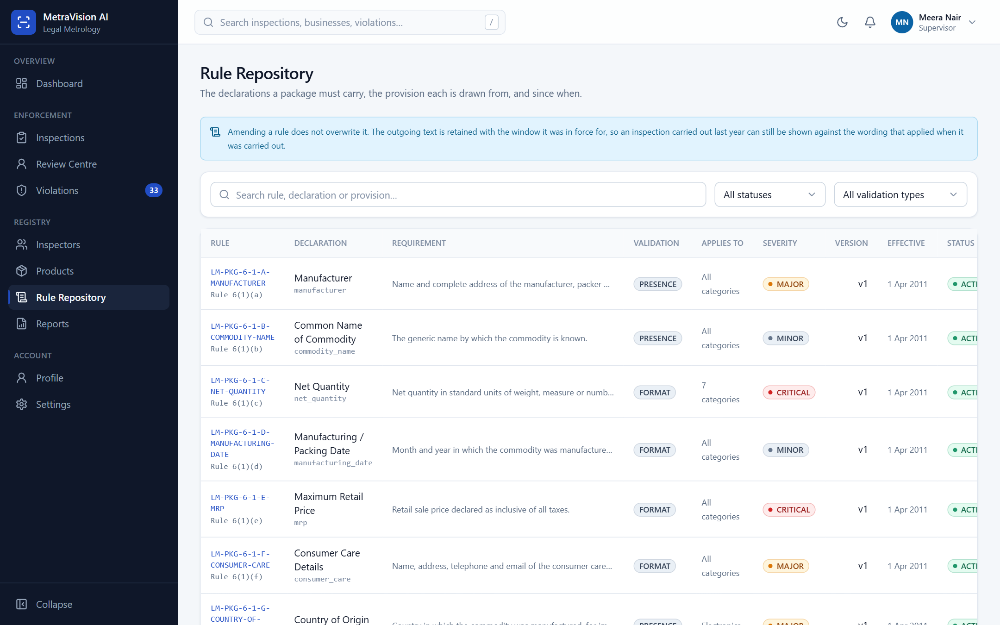 | |

---

## How it works

```
 PHOTO ─► OCR (PaddleOCR) ─► text + located regions ─► field extraction
       ─► structured declarations + evidence ─► Legal Metrology rule engine
       ─► rule-by-rule checks ─► findings ─► compliance report
       ─► mobile app  +  web console
```

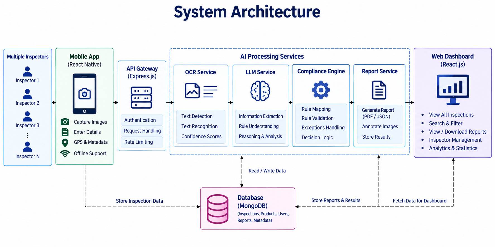

```
 React Native (Expo)            React (Vite)
    Field app                   Supervisor console
        │                              │
        └────────────  REST + JWT  ────┘
                       │
          Node.js · Express · TypeScript
                       │
         ┌─────────────┼──────────────┐
         │             │              │
      MongoDB     OCRProvider     Rule engine
                       │         (pure, versioned)
                       ▼
     PaddleOCR (local) · Google Vision · fixtures
```

- **Every stage sits behind an interface and records its own version**, so an
  inspection can be reproduced and the OCR engine can be swapped with one line of
  configuration.
- **An optional language model** (Gemini / Groq) can repair what the camera
  misread (`5OO g`, a smeared date, `₹` read as `?`). It only *reads* the label:
  it never decides anything about the law. If it is off, out of quota or slow,
  the scan falls back to the deterministic extractor and the report says so.
- **Neither client talks to the database.** Both go through the same API, which
  alone decides what each role may see.

Deeper write-ups live in [`docs/`](docs):
[OCR pipeline](docs/ocr-pipeline.md) ·
[Legal rule engine](docs/legal-rule-engine.md) ·
[Backend architecture](docs/backend-architecture.md) ·
[Database](docs/database.md) ·
[API reference](docs/api.md)

---

## Key features

- **Three verdicts, never a blind pass/fail.** When the photograph does not
  support a confident answer, the system asks a human instead of guessing.
- **AI output and human correction are stored separately, permanently.** The
  original reading (`aiValue`) is never overwritten by the reviewer's value. That
  keeps the evidence trail intact and makes every correction a training signal.
- **Evidence-linked findings.** Each finding points back to the OCR line and the
  photo it came from. Legal text is copied verbatim from the rule corpus, with the
  official source link.
- **Versioned rules.** An amended rule never overwrites the old one, so a past
  inspection is always shown against the wording in force on that day.
- **Category-aware.** Mandatory declarations are resolved per product category
  (food, cosmetics, pharmaceuticals, electronics…), not hard-coded.
- **Built for the field.** It works one-handed, outdoors, in sunlight and with
  gloves: ≥ 7:1 contrast, 48 dp touch targets, and status is never shown by colour alone.
- **Role-based access.** Inspector, supervisor and admin see only what their role allows.

---

## Tech stack

| Layer | Technologies |
| --- | --- |
| **Mobile** | React Native 0.81 · Expo SDK 54 · TypeScript · React Navigation 7 · Zustand · expo-camera · expo-secure-store |
| **Web** | React 18 · Vite 6 · TypeScript · Tailwind CSS · React Router 6 · TanStack Query 5 · Recharts |
| **Backend** | Node.js 20 · Express 4 · TypeScript · MongoDB 7 · Mongoose 8 · JWT + bcrypt · Zod · Helmet · Pino · Multer |
| **OCR** | PaddleOCR 3.7 (PP-OCRv5) in a Python/FastAPI sidecar · Google Cloud Vision (optional) |
| **LLM (optional)** | Gemini · Groq (Llama 3.3), used for reading only, with a deterministic fallback |
| **Testing** | Vitest · Supertest · labelled real-label corpus |

---

## Repository layout

```
MetraVision-AI/
├── mobile/        React Native + Expo field app
├── web/           React + Vite supervisor console
├── backend/       Node.js + Express + MongoDB API, rule engine, extraction
├── ocr-service/   Python PaddleOCR sidecar
├── docs/          Architecture, API, database, OCR and rule-engine docs
├── scripts/       Root dev scripts (start DB + OCR + API together)
├── testing/       Drop real package photos here to run them through the pipeline
├── RUNNING.md     Every run command, one service at a time
└── README.md
```

---

## Getting started

**Prerequisites:** Node.js ≥ 20, Python 3 (for the OCR sidecar), Git.
MongoDB does not need to be installed; the backend uses a local `mongod` binary.

```bash
git clone https://github.com/runtimeXerror/MetraVision-AI.git
cd MetraVision-AI

# install dependencies
npm --prefix backend install
npm --prefix web install
npm --prefix mobile install

# configure the API — every value has a working default
cp backend/.env.example backend/.env

# build the OCR environment once (weights download on the first scan, then offline)
npm run setup:ocr
```

Then run it in three terminals:

```bash
# 1 · Database + OCR service + API   →  http://localhost:4000/api
npm run dev

# 2 · Web console                    →  http://localhost:5173
cd web && npm run dev

# 3 · Mobile app                     →  press a / i, or scan the QR in Expo Go
cd mobile && npm start
```

The mobile app finds the API host from the Expo dev-server address, so a phone on
the same Wi-Fi works without configuration. See [`RUNNING.md`](RUNNING.md) for
running each service on its own.

### Demo accounts

The seed creates these (development only):

| Role | Login | Password |
| --- | --- | --- |
| Inspector | `LM-INS-4471` | `Inspector@123` |
| Supervisor | `meera.nair@legalmetrology.gov.in` | `Supervisor@123` |
| Admin | `admin@legalmetrology.gov.in` | `Admin@1234` |

Both sign-in screens fill these in with one tap.

### Verification

```bash
cd backend && npm run lint && npm run typecheck && npm test
cd web     && npm run lint && npm run typecheck && npm run build
cd mobile  && npm run typecheck
```

---

## What it does *not* claim

A compliance tool that overstates its own certainty is worse than no tool. So:

- A clean scan never says "100% compliant". It says **no compliance issues
  detected in the checks performed**, together with how many checks ran.
- **"Not detected" is never "not declared."** Whether a missing declaration counts
  as a violation depends on how much of the package was photographed.
- It does not weigh the product or measure letter heights yet. Rules 7(2) and 7(3)
  are reported as *measurement not available* and kept out of the headline verdict.
- No confidence score is ever invented. Where the OCR gives none, a person decides.

---

## Roadmap

1. Benchmark PaddleOCR against Google Vision on real field photographs.
2. Measure character height and width (Rules 7(2), 7(3)) using a reference scale.
3. Object-storage provider (S3 / GCS) beside local disk.
4. Server-side PDF rendering of the report, with a tamper-evident QR/hash.
5. Offline capture queue with background sync.

---

<div align="center">

Built by **[Vishal Kumar](https://github.com/runtimeXerror)**

</div>
